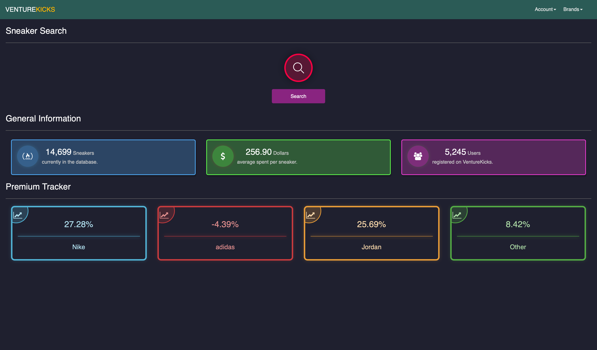
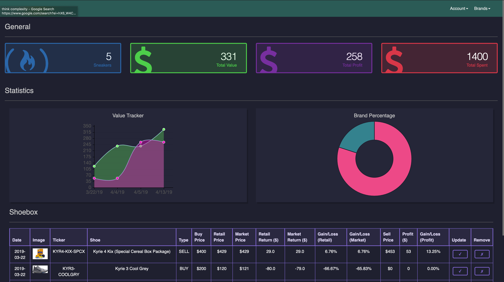
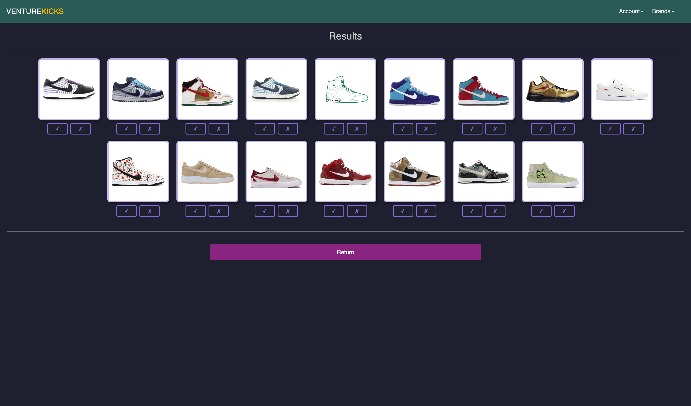

# Venture Kicks
An application to help people manage their inventory and make better purchases. 

## Demo
> www.venturekicks.com

## About
1. Sneaker Database created using BeautifulSoup and Selenium.
>a) Sneakers contain information like: Retail Price, Market Price, Image, Premium, Release Date, & more.
>b) Information is updated dynamically to represent its most recent statistics. 
2. Users can create accounts and track their purchases and/or profits by adding sneakers from the database. 
3. Users can find sneakers based on parameters like: Brand, Price Range, Premium, Market Value, & Color. 
4. Users can keep track of their favorite sneakers, while a content-based filtering system will reccomend shoes that other  like-users have favorited. 
5. Users can view data about the secondary sneaker market. 

## Stack
**Front-end**: HTML, CSS, Chart.js

**Back-end**: Flask, Jinja, BeautifulSoup, cv2

**Database**: SQLite3

## Dependencies
```python
pip3 install bs4
pip3 install tensorflow
pip3 install cv2
pip3 install requests
```

## Run - [from root folder]
```python
source ~/bin/activate
python3 run/wsgi.py
```

## Index


## Account


## Reccomendation


## Contact Me
chaseahn4@gmail.com